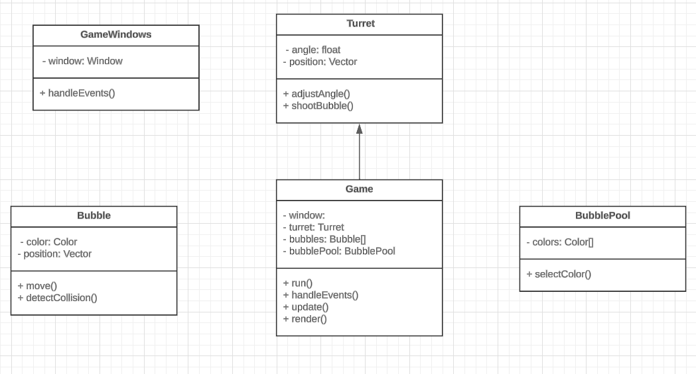

# BubbleTea Technical Specification

## Table of Contents
1. [Classes](#classes)
    1. [GameWindow](#gamewindow)
    2. [Turret](#turret)
    3. [Bubble](#bubble)
    4. [BubblePool](#bubblepool)
    5. [Game](#game)
2. [Game Loop](#game-loop)
3. [Game Over Condition](#game-over-condition)

## Overview
BubbleTea is a bubble shooter game where the player controls a turret at the bottom of the screen and shoots bubbles to match colors and clear the screen. The game will be implemented in C++ using the SFML library for graphics and input handling.

## SFML library
SFML (Simple and Fast Multimedia Library) is a cross-platform software development library designed to provide a simple interface to various multimedia components in computers. It is written in C++ and has bindings for various other languages. SFML provides modules for graphics, audio, network, and windowing, making it suitable for developing games and multimedia applications.

To use SFML in a C++ project, you need to download and install the SFML library and link it to your project. The following tutorials provide instructions on how to set up SFML for different operating systems:
- **Linux**: https://www.sfml-dev.org/tutorials/2.6/start-linux.php
- **Windows**: https://www.sfml-dev.org/tutorials/2.6/start-vc.php
- **Mac**: https://www.sfml-dev.org/tutorials/2.6/start-osx.php

The source code is exacly the same for all operating systems.

### GameWindow
The `GameWindow` class will encapsulate the SFML window. It will handle window events such as closing the window, clicking the left mouse button, and moving the mouse.

### Turret
The `Turret` class will represent the turret at the bottom of the screen. It will have methods to adjust its angle based on mouse movement and to shoot bubbles.

### Bubble
The `Bubble` class will represent a bubble. It will have properties for its color and position, and methods for moving and detecting collisions with other bubbles or the walls.

### BubblePool
The `BubblePool` class will manage the pool of bubbles. It will have a method to randomly select a color from the available colors for each shot.

### Game
The `Game` class will manage the game loop and game state. It will have properties for the game window, turret, and bubble pool, and methods for running the game loop, handling events, updating the game state, and rendering the game.

## Game Loop
The `Game::run()` method will implement the game loop. It will clear the game window at the start of each iteration, handle window events, update the game state, and render the game.

## Game Over Condition
The `Game::update()` method will check if the bottom row of bubbles has reached the bottom of the screen. If it has, it will set a game over flag and stop the game loop.

## Class diagram

## Conclusion
This technical specification outlines the main classes and their methods and properties that will be used to implement the game. The actual implementation will involve creating these classes and implementing the described functionalities in C++ using the SFML library.

